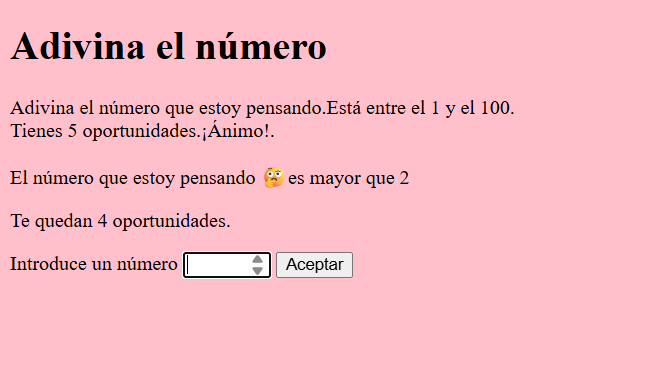
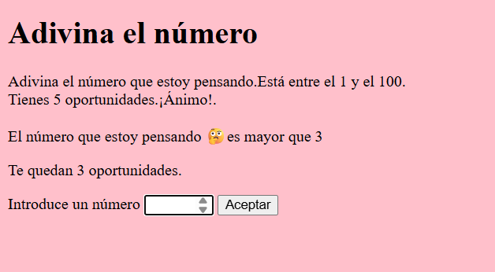
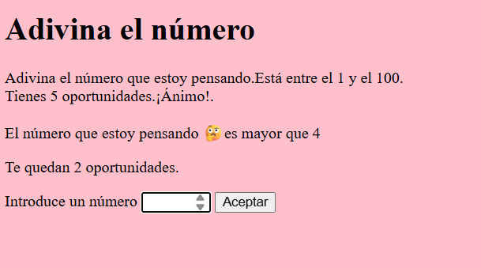
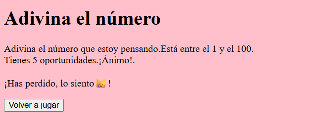

# Juego PHP "Adivina el número"

Juego realizado en **PHP** en el que el usuario intenta adivinar el número que ha pensado el ordenador.

Tendrás <ins>5 intentos</ins> para averiguar el número.

##  Características del juego:

*Realizado en PHP
*Sigue buenas prácticas
*Programado con cariño ❤️
*Adictivo

Dale una ⭐ a este repo si te ha gustado.
